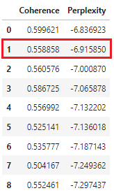

# 다이어트 보조제 리뷰 텍스트마이닝을 활용한 다이어트 보조제 제품 추천 웹사이트 개선 전략 연구: LDA 토픽모델링을 중심으로


## 1. 개요
본 프로젝트는 다이어트 보조제 제품의 리뷰 텍스트마이닝을 통해 고객 니즈를 도출하고, 이를 바탕으로 다이어트 보조제의 제품 추천 전략을 제안합니다. 국내 올리브영, 위메이크, 스키니랩 총 3개의 사이트에서 다이어트 보조제 제품 리뷰 7천 건을 수집하고, LDA 토픽 모델링을 통해 심층적으로 고객 니즈를 분석합니다.

## 2. 데이터셋
- 국내 올리브영, 위메이크, 스키니랩 사이트에서 다이어트 보조제 제품 리뷰 7천 건 수집 
- 데이터 수집 방법: 리뷰 수집 스크래핑 

## 3. 분석 방법론: LDA 토픽 모델링
토픽 모델링(Topic Modeling)은 텍스트 기반의 문서 데이터에서 핵심 주제(Topic)를 찾는 텍스트마이닝 방법론입니다. 특히, 잠재 디리클레 할당(Latent Dirichlet Allocation, LDA)은 토픽 모델링의 가장 대표적인 알고리즘입니다. 구체적으로, LDA 토픽 모델링은 확률 기반의 모델링 기법을 통해 방대한 양의 문서 데이터를 분석함으로써 문서 내에 어떤 토픽이, 어떤 비율로 구성되어 있는지 분석합니다[(Blei et al., 2003)](https://www.jmlr.org/papers/volume3/blei03a/blei03a.pdf?ref=https://githubhelp.com). 또한, 토픽별로 어떤 키워드가 구성되었는지 정보를 제공하기 때문에, 키워드 조합을 통해 인사이트를 도출하는 데 효과적인 장점이 있습니다. 최근에는 LDA 토픽 모델링을 통해 SNS에서 유사한 토픽을 자동으로 분류하거나 항공사 온라인 리뷰를 분석하여 고객 니즈를 도출하는 등 다양한 분야에서 연구가 활발히 진행되고 있습니다([Lu et al., 2013](https://ieeexplore.ieee.org/abstract/document/6454769), [Kwon et al., 2021](https://www.mdpi.com/2078-2489/12/2/78)).

## 4. LDA 최적의 토픽 갯수 선정 
Topics(주제)란, 수집된 원문 내용에 담긴 다양한 키워드를 기반으로 내용을 그룹화 시켜주는 것으로, CoherenceModel 을 통한 토픽 최적화를 진행하였습니다. 토픽이 얼마나 의미론적으로 일관성 있는지 판단하기 위함이며, 수치가 높을수록 의미론적 일관성 높습니다. [(토픽모델링LDA방법론)](http://bigdata.emforce.co.kr/wp-content/uploads/%EC%97%A0%ED%8F%AC%EC%8A%A4-%EB%8D%B0%EC%9D%B4%ED%84%B0%EB%9E%A9_%ED%86%A0%ED%94%BD%EB%AA%A8%EB%8D%B8%EB%A7%81LDA%EB%B0%A9%EB%B2%95%EB%A1%A0-%EC%A0%95%EB%A6%AC.pdf)

<div align="center">
 
 

  그림 1. 긍정적 리뷰의 최적화된 토픽 갯수 선정 근거 



  그림 2. 부정적 리뷰의 최적화된 토픽 갯수 선정 근거 
</div>

## 5. LDA 토픽 모델링 결과
- ```pyLDAvis``` 패키지를 활용하여 LDA 토픽 모델링 결과 시각화
- 긍정적 리뷰와 부정적 리뷰에서 각각 토픽 10개씩 추출
<div align="center">

  

  그림 3. 긍정적 리뷰의 토픽 모델링 결과   

  

  그림 4. 부정적 리뷰의 토픽 모델링 결과   
</div>

## 6. 인사이트 도출

### 긍정적 리뷰 분석 

[(0,
  '0.068*"좋다" + 0.034*"맛" + 0.018*"구매" + 0.017*"웃음" + 0.016*"제품" + 0.016*"눈물" + 0.015*"물" + 0.013*"효과" + 0.011*"빠지다" + 0.011*"꾸준하다"'),
 (1,
  '0.032*"좋다" + 0.029*"웃음" + 0.022*"구매" + 0.018*"편하다" + 0.018*"제품" + 0.016*"배송" + 0.015*"맛" + 0.015*"운동" + 0.013*"맛있다" + 0.013*"꾸준하다"')]

1) 효과 - 키워드:  효과, 빠지다, 꾸준하다 
1번 토픽에 ‘효과’, ‘빠지다’, ‘꾸준하다’와 같은 단어가 빈출되었습니다. 이를 통해 제품에 대한 긍정적인 평가에 있어서 제품의 효과가 중요한 부분을 차지함을 확인할 수 있습니다. 다이어트 보조제의 주기능인만큼 구매자는 보조제를 꾸준하게 섭취했을 때 살이 빠지는 효과를 기대하기 때문에, 다이어트 보조제 추천 사이트에서는 효과가 탁월한 보조제의 추천이 필수적임을 알 수 있습니다. 

2) 구매 방식의 편리성 - 키워드: 구매, 편하다, 제품, 배송 
2번 토픽에 ‘구매’, ‘편하다’, ‘제품’, ‘배송’ 와 같은 단어가 빈출 된 것을 확인할 수 있습니다. 이는 제품 구매자가 배송과 같은 구매 방식이 편한 것을 선호한다는 것을 도출할 수 있습니다. 이에 구매자들의  선호에는 구매 방식의 편리성이 중요한 역할을 미친다는 것을 확인할 수 있습니다. 다만 해당 토픽이 LDA분석에 선정된 토픽이지만, 구매방식, 배송 등과 같은 내용이 저희 프로젝트 구현에는 의미가 없기에 해당 토픽을 다루지는 않을 예정입니다.

3) 맛 - 키워드 : 맛, 맛있다
	1번과 2번 토픽에 ‘맛’, ‘맛있다’와 같은 단어가 빈출 된 것을 확인할 수 있습니다. 이에  
다이어트 보조제인 영양제에도 맛이 선호에 확실한 영향을 미친다는 것을 확인할 수 있습니다. 젤리, 포와 같은 직접적인 미각에 영향을 끼치는 다이어트 보조제일수록 선호되는 맛이 구매자에게 긍정적인 피드백이 많음을 알수 있습니다. 따라서 다이어트 보조제의 맛을 기반으로 상품이 추천될 필요가 있음을 알 수 있습니다. 


### 부정적 리뷰 분석 

[(0,
  '0.029*"효과" + 0.019*"눈물" + 0.017*"웃음" + 0.016*"제품" + 0.016*"맛" + 0.011*"좋다" + 0.009*"가격" + 0.009*"구매" + 0.008*"비싸다" + 0.008*"꾸준하다"'),
 (1,
  '0.048*"눈물" + 0.029*"효과" + 0.028*"맛" + 0.020*"좋다" + 0.011*"웃음" + 0.010*"구매" + 0.009*"알약" + 0.009*"화장실" + 0.009*"크다" + 0.006*"후기"'),
 (2,
  '0.024*"구매" + 0.020*"눈물" + 0.019*"효과" + 0.019*"맛" + 0.017*"제품" + 0.016*"좋다" + 0.011*"빠지다" + 0.010*"후기" + 0.009*"알약" + 0.009*"가격"')]

1) 비싼 가격  - 키워드: 비싸다, 제품, 가격, 구매
1번 토픽에 ‘비싸다’, ‘제품’, ‘가격’, ‘구매’와 같은단어가 빈출된 것을 확인할 수 있습니다. 다이어트 보조제의 가격이 비싼 제품들이 제품 구매자로부터 부정적인 평가를 받았다고 볼수 있습니다. 이에  구매자가 다이어트 보조제를 구매할때 가격을 고려하여 구매한다는 점을 파악 할 수 있습니다. 따라서, 낮은 가격순으로 추천 또는 가격대에 따라서 추천하는 기능을 구현한다면 구매자의 사이트 이용에 편이성을 부여될 수 있습니다. 

2) 섭취 - 키워드: 맛,  알약, 크다
2번 토픽에 ‘맛’, ‘알약’, ‘크다’와 같은 단어가 빈출되었습니다. 다이어트 보조제의 만족스럽지 못한 맛과 불편한 섭취 방식이 부정적인 평가에 영향을 미친다는 것을 볼 수 있습니다. 부정적인 평가의 리뷰 텍스트에서 ‘크다’라는 단어가 쓰인 부분을 검토해보았을 때, ‘알약’의 큰 크기에 대한 언급이 있었으며, 이를 통해 다이어트 보조제 섭취에 있어 알약의 크기가 중요하게 작용함을 확인할 수 있습니다. 따라서, 구매자들이 선호하는 맛과 섭취방식을 반영하여 제품을 추천해야함을 알 수 있습니다. 

3) 효과 - 키워드: 효과, 빠지다  
3번 토픽에 ’효과’, ‘빠지다’와 같은 단어가 빈출 된 것을 확인할 수 있습니다. 구매자들이 다이어트 보조제의 기능에 초점을 맞춰 효능이 제대로 발휘 되지 않는다면 부정적인 평가를 준다는 점을 확인할 수 있습니다. 따라서, 효과가 탁월한 보조제의 추천이 필수적임을 알 수 있습니다. 

